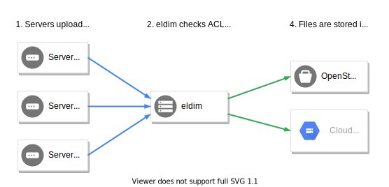

# eldim

A Secure File Upload Proxy

## Description

eldim is a web server that accepts file uploads from a particular set of
hosts, and its job is to encrypt them, and then store them in an Object
Storage backend system.



It has a preconfigured ACL that only allows specific IP Addresses, or token
bearers to access the file upload service. After a file is uploaded, it is
encrypted, and then uploaded to a configured provider.

It has been designed to work as a standalone application, which means it must
not sit behind a proxy, but instead be exposed directly to the Internet.

## Groups & Mailing Lists

Currently the project has two mailing lists, in Google Groups, that are used
for communication:

### eldim-announce

The [eldim-announce](https://groups.google.com/forum/#!forum/eldim-announce)
group is **recommended** for all users of eldim. It includes announcements
for new versions, a changelog, as well as breaking changes that may occur
in the future. Moreover, it is the place that will be used for security
announcements in the future, if and when they come.

This is a very low volume list, and it is read-only. That is, only eldim
updates are posted there, and you cannot send e-mails to other members.

### eldim-dev

The [eldim-dev](https://groups.google.com/forum/#!forum/eldim-dev) group
tries to address that final point above, and it is the techincal mailing
list of the eldim project.

This group can be used to report problems, share news, exchange ideas, etc.
Basically it exists for communication about technical matters related to
eldim, between the users, the contributors, or the developers.

## Design Decisions

The design of eldim is data agnostic, and tries to push the relevant logic
of all operations to the proper server. For example, the service itself does
not care what types of files are uploaded, or when they're uploaded, or what
they are. It simply receives a file and a file name, and then encrypts and
uploads this file under a specific name to the Object Storage.

In eldim's configuration file you can add a list of hosts, as well as their
(host)names, and eldim makes sure that all files uploaded from a particular
host will always have that host's name in their name. For example, files from
the host `mail.example.com`, will always have a file name starting with
`mail.example.com/`.

The data collection part is left to the servers sending data to it. It is
them who decide what to send, when to send it, and what operations, such as
compression for example, must be applied to the file.

## Security

In order for every server to be able to upload logs or backups to a central
object storage bucket, they need to have some secrets stored in them. For
example, in Swift, each server needs to have a username and an API key. This
is something that is not really secure, as compromising any server would give
full access to the backup repository. An attacker could download files, delete
files, change them, etc.

In eldim, the servers do not have any stored information, and instead just
upload the files to a single server. This server is the one with the access,
and can control what operations are being performed, and by whom.

The way eldim works, no server is allowed to mess with another server's files.
Server `mail.example.com` cannot upload files as `ftp.example.com`, even if
they upload to the very same bucket. eldim automatically prepends all file
uploads with the server hostname, which is inside its configuration file, and
not sent by the servers themselves.

Moreover, eldim will reject files that already exist. If the file
`mail.example.com/2018-01-01/mail.log.tgz` already exists in any backend,
it will not allow for it to be overwritten. This check is enforced both at
the eldim level and at each storage backend (S3, Swift, and GCS), and is in
place to prevent a hacked server from overwriting all previous log entries
with empty data, effectively deleting everything. Parallel uploads of the
same file name to the same eldim instance are also rejected.

Finally, eldim works only over HTTPS. This decision is hard coded inside the
server itself, and cannot be changed by the configuration file. A code change
is required. It is configured to only work with at least TLSv1.2 (TLSv1.2
and TLSv1.3 are the only currently secure versions of TLS), and defers to
Go's default cipher suite selection, which follows modern best practices.

### Encryption

Since version v0.6.0, eldim uses [age](https://age-encryption.org/) for file
encryption. It is a well defined protocol, with multiple implementations, a
very good CLI tool, and is already part of some operating system distributions.
More importantly, it is modern, well-designed, and opinionated, with one and
only one purpose in mind: encrypt files. It uses state of the art practices
and algorithms, and is also very flexible.

age is using asymmetric encryption, which means that eldim only needs to know
about the **public** keys in its configuration file, and never needs or has
access to the *private* keys. This vastly reduces the risk of a compromised
eldim server, as files uploaded cannot be decrypted by the attacker.

With age, eldim supports multiple public keys, so you can use more than one,
and have the files encrypted with all of them. That means that files can be
decrypted with **any** of the keys. You can use this functionality to have
backup keys, or give access to multiple people, each one holding their own
key pair. Unfortunately, eldim currently does not support *M of N* so you
need to keep this in mind while threat modelling.

To generate an age keypair, you can use the `age-keygen` CLI tool. However,
a very nice feature is that eldim also supports SSH keys! You can use your
RSA or Ed25519 SSH keys in addition to the age keys. A single eldim server
supports multiple keys, of different types.

## How to run eldim

> [!TIP]
> eldim has macOS and Linux binaries as well as Debian `.deb` packages now in
> [Releases](https://github.com/daknob/eldim/releases) that automate its
> installation and operation, taking care of most of what's written below!

eldim runs as a daemon, since it has to listen for HTTPS requests continuously.
For this reason, you need to ensure that the binary is running all the time.
The recommended way of achieving this is through your operating system's
startup / init system. If you are using `systemd`, a unit file is provided in
this repository for you to use. It also includes optional sandboxing directives
that can be uncommented to further restrict what eldim can access, reducing the
impact of a potential compromise.

As with any software, it is **not** recommended to run eldim as `root`. For
this reason, you should create an `eldim` user. The included `systemd` unit
file assumes the `eldim` user exists in the system.

You can create such user by running:

```bash
sudo useradd -s /usr/sbin/nologin -r -M eldim
```

When executed, eldim has two command line flags that you can use to configure
it before it even reads the configuration file. They are:

* `-j`: When set, it will output all logs in JSON format, instead of structured text
* `-c`: The path to the configuration file

## Metrics

As of `eldim v0.2.0`, eldim supports metrics exporting using
[Prometheus](https://prometheus.io/). You can find more information about the
metrics currently supported and exported [here](docs/metrics.md).

## Configuration

In order to read the full documentation on how to configure `eldim`, click
[here](docs/config.md).

## The HTTP API

You can find the full specification of the HTTP API of `eldim` by clicking
[here](docs/api.md).

## How to upload data from a server

You can basically upload files to eldim in any way you like, as long as you
follow the above API, but here are some examples. This code can be for example
in a daily or weekly cron job:

```bash
# Compress nginx' access.log
tar -zcf /tmp/nginx.access.log.tgz /var/log/nginx/access.log /var/log/nginx/access.log.1
# Upload to eldim
curl -F filename=$(date +%F-%H-%M)/access.log -F file=@/tmp/nginx.access.log.tgz https://eldim.example.com/api/v1/file/upload/
```

The `$(date +%F-%H-%M)` part will automatically print the date in the
`2018-01-01-13-37` format (`YYYY-MM-DD-HH-MM`).

If you are testing eldim, you may use `-k` in `curl`, to skip certificate
checks, as you may be using a self-signed certificate. However, deploying
this to production without a trusted certificate is **not** recommended.

For production workloads, you may want to use the `--retry N` flag of `curl`,
to retry the request up to `N` times, if it fails. It is recommended to also
set the `--retry-connrefused` flag as well. You can combine the above with
`--retry-delay X`, so `curl` will sleep `X` seconds between retries. Good
values for `X` are eldim's domain TTL * 2, or something similar.

eldim is designed to work without placing trust on the file upload servers.
If, however, you want to not have to trust the eldim server either, you can
optionally encrypt all data sent to eldim with `age` (or `gpg`). That way
eldim won't be able to decrypt them, but neither will the sender alone.

To encrypt files with `age`, use:

```bash
cat file.tgz | age -r "AgeID" > out.tgz.enc
```

Of course, you need to replace "AgeID" with an age recipient address.

## eldim Logs

Currently eldim logs a lot of information in detail. This is done on purpose
and is not a debugging leftover. Since it is a tool that is related to
security, it is always good to have a lot of information to be able to go back
to in case something happens.

It is totally normal for eldim to log up to 20 lines per successful upload
request, or even more, depending on the configuration.

During service startup, all information logged is related to actions and
the configuration file. After the service is started, all logs include a
Request ID. During the arrival of every request, eldim generates a unique
random identifier for this request. This identifier is included in every
future log entry that is related to this request.

By default eldim logs to `stderr`, so if you are using the provided
`systemd` unit file, all its logs will be available in `syslog`.
